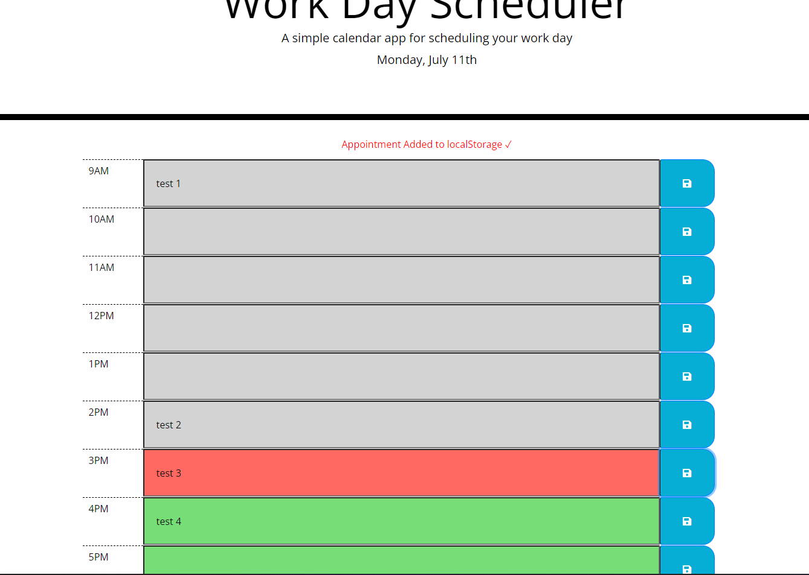

# Work-Day-Scheduler
#
# current day is displayed at the top of the caclendar
# timeblock is displaied for standard business hours colored by on past, present and future
# can enter and save event in timeblock/local storage
#
# see link to the application
# https://canon70d.github.io/Work-Day-Scheduler/
#
# attached a overview of Quiz page
# 